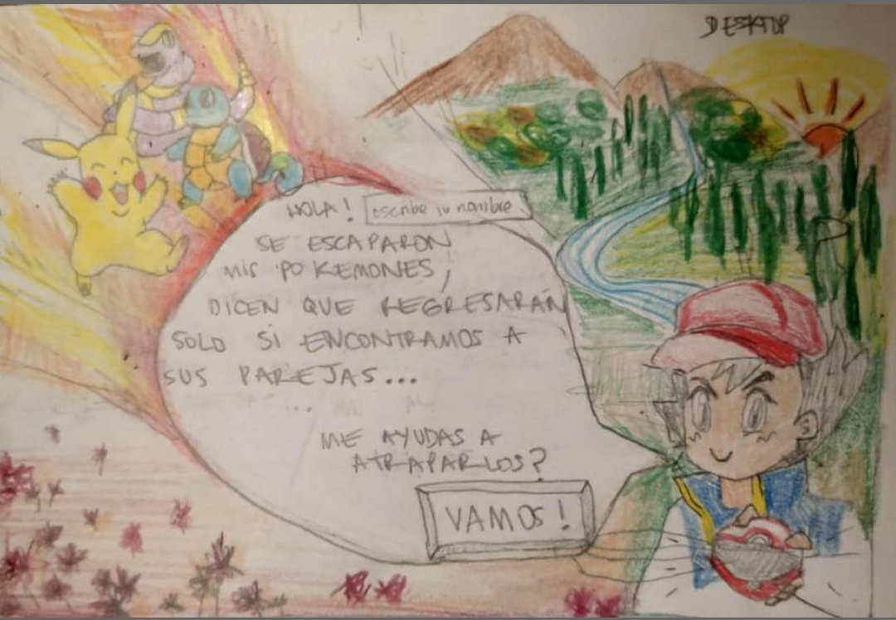
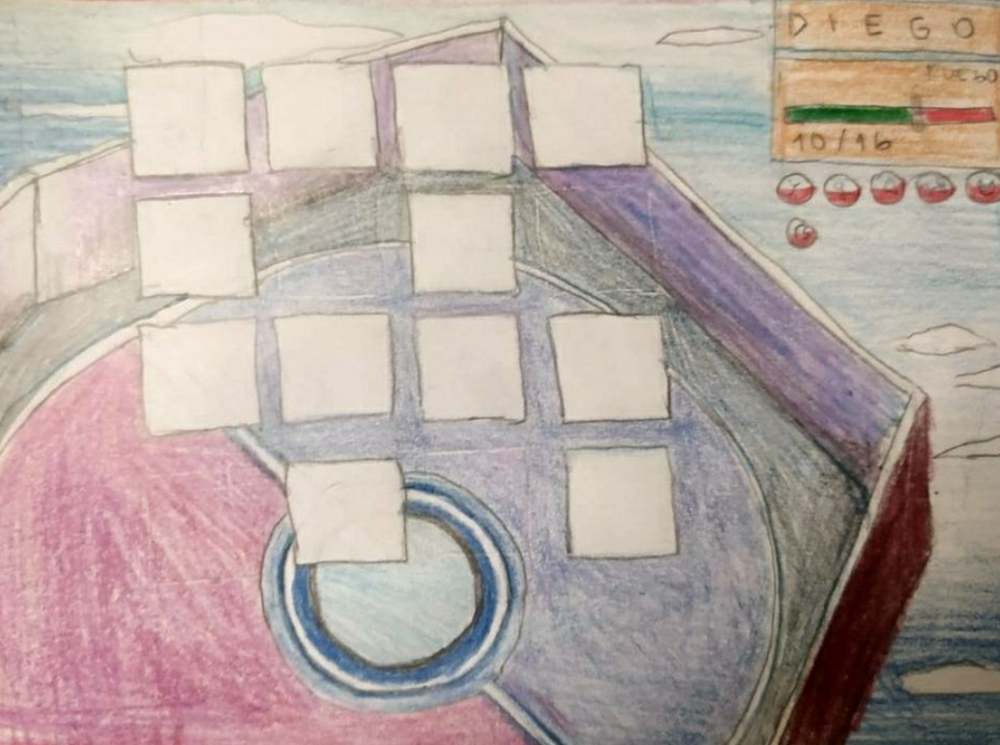

# PokeMemorice

PokeMemorice es un juego creado para niñes entre 7 y 10 años, pero si tienes presente a tu niñ@ interior también puedes jugar ;). El juego sigue las reglas de un clásico memorice pero debes encontrar pares de pokemones y podrás saber en cuántas oportunidades lo lograste.
Además podrás conocer pokemones entre más de 800 existentes y elegir la cantidad de cartas para aumentar la dificultad.

Pruébalo! https://random-characters-memory-match.vercel.app/

## Historias de usuario

<b>1-</b> El usuario quiere una interfaz inspirada en Pokemón e interactiva. 
<b>2-</b> El usuario quiere seleccionar la cantidad de tarjetas para jugar.  
<b>3-</b> El usuario quiere conocer pokemones de una data de más de 800 existentes.
<b>4-</b> El usuario quiere el set de tarjetas presentadas boca abajo aleatoriamente para empezar a jugar.  
<b>5-</b> El usuario quiere poder destapar las cartas de 2 en 2.  
<b>6-</b> El usuario quiere saber las parejas que ya ha encontrado.  
<b>7-</b> El usuario quiere saber que ganó.  
<b>8-</b> El usuario quiere saber cuántas oportunidades le tomó completar el juego.  
<b>9-</b> El usuario quiere poder volver a jugar cuando haya terminado.  
<b>10-</b> El usuario quiere poder jugar en distintos dispositivos.    

## Criterios de Aceptación  
<b>1-</b> Diseño de tarjeta similar a las cartas doradas de Pokemón, inclusión de sonidos de la serie Pokemón.
<b>2-</b> Incluir 3 opciones de cantidad de tarjetas antes de iniciar el juego.
<b>3-</b> Creación función random para encontrar pokemones desde la base de datos. 
<b>4-</b> Creación de función con el algoritmo de Fisher-Yates para barajar tarjetas, uso de animación en CSS para darlas vuelta.    
<b>5-</b> Darle click a la tarjeta para que muestre al Pokemón. Mantener la primera tarjeta develada. Mostrar una segunda tarjeta clickeada y bloquear un tercer click.  
<b>6-</b> Si la elección hace match se mostrará la pareja capturada fuera del tablero. Si no, se darán vuelta de nuevo.      
<b>7-</b> Mostrar un pop-up de felicitaciones con música informando que ganó.  
<b>8-</b> Crear contador por par de selecciones.  
<b>9-</b> Incorporar botón que reinicie el juego.  
<b>10-</b> Definir el estilo de la aplicación con propiedades responsivas 

## Definición de Terminado:
-Test unitarios en un 70% en statements y funciones.  
-Testeo de usabilidad con usuarios del juego.  
-Deployment del programa en GitHub Pages.  
-Responsive para móviles, tablets y desktops.

## Diseño de la Interfaz de Usuario

### Prototipo de baja fidelidad

### Prototipo de alta fidelidad

